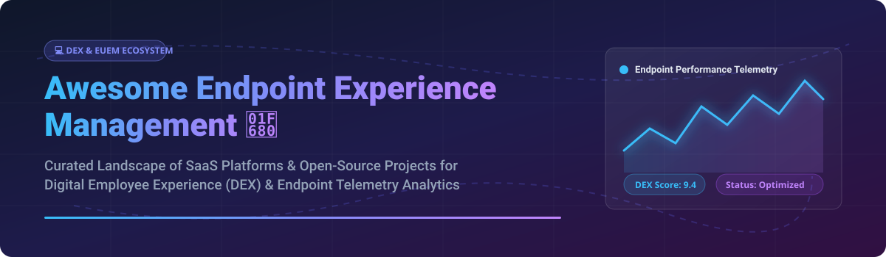

# Awesome Endpoint Experience Management 🖥️⚡

 

## 📌 Ecosystem Overview & Digital Employee Experience (DEX)

A curated landscape of **SaaS platforms** and **open-source GitHub projects** dedicated to **Endpoint Experience Management**, **Digital Employee Experience (DEX)**, **End-User Experience Monitoring (EUEM)**, proactive IT remediation, and endpoint performance analytics. 📊🔍

These telemetry and analytics systems track real-time desktop health, monitor application performance, score employee digital experience, and trigger automated self-healing workflows across physical, virtual (VDI), and cloud environments. 💻✨

---

## 📈 Market Dynamics & Industry Insights

> [!NOTE]
> **Market Size & Structure**: The global **Digital Employee Experience (DEX) and Endpoint Management market** is estimated at **$3.5 Billion (2026)** and is projected to grow at a CAGR of **15.2%** to reach over **$7.1 Billion by 2030**.
> 
> **Market Fragmentation**: The sector is **moderately concentrated** with enterprise category leaders (such as Nexthink, ControlUp, and Lakeside Software) dominating large corporate estates, while specialized APM/observability vendors and open-source frameworks serve custom engineering workflows.

---

## ☁️ SaaS / Enterprise Hosted Platforms

Below is a breakdown of top SaaS platforms for Endpoint Experience Management, sorted descending by company size (valuation / annual revenue) 🏆:

| SaaS Platform 🚀 | Company Size & Valuation 💰 | Starting Pricing 💵 | Free Tier / Trial Limits ⏳ | Key Features & Capabilities 🛠️ |
| :--- | :--- | :--- | :--- | :--- |
| **[Nexthink](https://www.nexthink.com/)** 👑 | **~$3.0 Billion Valuation** ($350M+ ARR) | ~$18.50 per endpoint/year (Enterprise custom billing) | No permanent free tier; 14-day enterprise proof-of-concept (PoC) demo on request | Market leader in DEX scoring, proactive NQL remediation, sentiment surveys, and real-time device telemetry. |
| **[Riverbed Aternity](https://www.riverbed.com/)** 🌐 | **~$1.5 Billion Valuation** ($400M+ Revenue) | Custom enterprise quote (~$12-$25/device/yr estimated) | 14-day guided trial available for qualified enterprises | End-user experience monitoring, transaction-level visibility, and application performance analytics. |
| **[ControlUp](https://www.controlup.com/)** 🦄 | **~$1.0 Billion Valuation** ($100M+ ARR) | Quote-based (~$15-$30 per active user/year) | 21-day full feature free trial (up to 50 endpoints) | Real-time VDI & physical endpoint monitoring, synthetic testing, auto-remediation triggers. |
| **[Lakeside SysTrack](https://www.lakesidesoftware.com/)** 🏢 | **~$600 Million Valuation** ($80M+ ARR) | Enterprise custom quote (~$15-$28/endpoint/yr) | 14-day evaluation environment upon sales approval | Deep OS & hardware telemetry, root-cause troubleshooting, desk health analytics, and AI insights. |
| **[1E Tachyon](https://www.1e.com/)** ⚡ | **~$300 Million Valuation** ($50M+ ARR) | Enterprise custom quote | 30-day proof-of-concept trial via partner network | Real-time endpoint querying, automated patch remediation, and experience sentiment analysis. |
| **[UberAgent](https://uberagent.com/)** 🔍 | **~$30 Million Valuation** ($5M+ ARR) | $8.50 per endpoint/year (Standard License) | Free full-featured trial for 30 days (unlimited devices) | Lightweight endpoint & user experience agent sending rich metrics directly to Splunk & Elasticsearch. |

---

## 🔓 Open-Source GitHub Projects

Explore open-source building blocks, agents, and metrics pipelines to build DIY endpoint telemetry systems. Sorted descending by GitHub Star count ⭐:

| Open-Source Project 🛠️ | GitHub Stars ⭐ | Primary Scope & Focus 🎯 | Description & Architecture 📜 |
| :--- | :--- | :--- | :--- |
| **[Grafana](https://github.com/grafana/grafana)** |  | Visualization & Dashboards | The premier open observability platform to visualize endpoint health metrics, logs, and custom DEX dashboards. |
| **[Elasticsearch](https://github.com/elastic/elasticsearch)** |  | Search & Analytics Engine | Distributed search engine for aggregating endpoint logs, event streams, and real-user experience telemetry. |
| **[Prometheus](https://github.com/prometheus/prometheus)** |  | Metrics Collection & Time-Series | Cloud-native time-series database ideal for scraping endpoint metrics via node_exporter / windows_exporter. |
| **[OpenTelemetry Collector](https://github.com/open-telemetry/opentelemetry-collector)** |  | Vendor-Neutral Telemetry | Standard collector agent for receiving, processing, and exporting traces, metrics, and logs from client apps. |
| **[osquery](https://github.com/osquery/osquery)** |  | Endpoint Instrumentation | Exposes an OS as a relational SQL database, enabling SQL queries for process health, disk space, and performance. |
| **[Wazuh](https://github.com/wazuh/wazuh)** |  | Security & Fleet Monitoring | Unified SIEM & XDR agent providing security monitoring, file integrity, and endpoint health status. |
| **[Fluent Bit](https://github.com/fluent/fluent-bit)** |  | Lightweight Log Shipper | Fast, low-resource telemetry processor for collecting logs and metrics from endpoints and desktops. |
| **[Vector](https://github.com/vectordotdev/vector)** |  | High-Performance Data Pipeline | Ultra-fast Rust-based log and metrics collector to route endpoint telemetry to storage backends. |
| **[Fleet](https://github.com/fleetdm/fleet)** |  | osquery Management & Orchestration | Open-source device management platform to orchestrate osquery across thousands of Windows, macOS, and Linux devices. |
| **[Glances](https://github.com/nicolargo/glances)** |  | Cross-Platform System Monitoring | An open-source curses and Web-based system monitoring tool for real-time endpoint CPU, memory, and disk telemetry. |
| **[GlitchTip](https://github.com/glitchtip/glitchtip)** |  | Application Error Tracking | Open-source Sentry-compatible error tracking tool to capture client application crashes and user experience bugs. |
| **[Netdata](https://github.com/netdata/netdata)** |  | Real-Time Infrastructure Monitoring | High-frequency endpoint monitoring agent providing per-second performance graphs and immediate troubleshooting. |

---

## 🤝 How to Contribute

Contributions are welcome! 🎉 To add a new DEX platform, EUEM tool, or open-source endpoint monitoring project:

1. **Fork** this repository 🍴
2. **Add/Edit** entries in `README.md` following the table format.
3. Check out [Awesome-Awesome-Awesome](https://github.com/ishandutta2007/Awesome-Awesome-Awesome) for contribution guidelines! 📑
4. Submit a **Pull Request** with a brief summary of the added solution. 🚀

---

## 💖 Support & Community

If you find this repository helpful, please consider supporting the project! ☕🌟

- ⭐ **Star** this repository to help others discover it!
- 🔀 **Fork** and contribute your favorite endpoint management tools!
- 📢 **Share** with your IT Operations, DevOps, and Digital Workplace colleagues!
- 💖 **Sponsor**: Support ongoing maintenance via [GitHub Sponsors](https://github.com/sponsors/ishandutta2007).

---

## 📈 Star History

---

## 📜 Disclaimer

This repository is community-curated for informational and educational purposes. All product names, logos, and trademarks belong to their respective owners.
